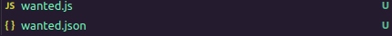

# BashCrashers MusicApp banners

## Como contribuir

Crea un fork del proyecto, diseña tu banner y abre un PR para fusionar los cambios

## Como crear un banner

- Antes que nada, instala las dependencias: `npm i`

- Para crear un banner debes generar un archivo de javascript (.js) en la carpeta raíz, y un archivo .json, ambos con el mismo nombre.



**Nota:** Sólo tendrás acceso a las variables definidas en `/typings/index.d.ts`. Si usas VSCode deberías tener ayuda de autocompletado del editor de código los tipos definidos en el archivo mencionado.

## Como probar el banner

Para correr un banner puedes definir datos de prueba en `samples/`. Estos se cargan si se pasan como argumentos al script `npm start`

- Usa: `npm start -- <nombre_del_banner> <sample_artistas> <sample_usuario>`

## Observaciones a archivos

Reglas de archivo .js:

1. No hay modulos
2. Todo el código debe ser envuelto en una función asíncrona
3. Se debe retornar un buffer obtenido a través de canvas#getBuffer

Reglas de archivo .json:

1. Las rutas a las imagenes no pueden moverse de directorio, es decir, es únicamente el nombre del archivo: `./algo.ttf` es incorrecto, mientras que `algo.ttf` es correcto.
2. Para las fuentes no se puede usar otra extensión mas que: `.ttf`

## Campos permitidos en archivo .json

```typescript
BannerConfig {
    width: number; // ancho en px del banner
    height: number; // altura del banner
    description?: string; // descripción del banner
    example?: string; // url de imagen de ejemplo
    author: string; // tu nombre
    name: string; // nombre del banner
    images: string[]; // arreglo con imagenes a cargar
    fonts: {  // arreglo de fuentes a cargar
        src: string; // nombre de la fuente (ver observaciones)
        family: string; // nombre con el que se accederá en el archivo js
    }[];
}
```
